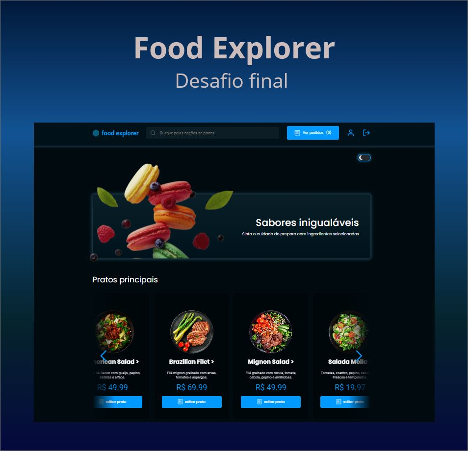

<p align="center">
  <h1 align="center"><a href="https://food-explorer-vasc-333.netlify.app/">🍴 Food Explorer - Rocketseat 🍴</a></h1>
</p>



## 📝 Sobre

O Food Explorer é uma plataforma online completa para restaurantes, oferecendo aos clientes uma experiência abrangente de pedidos e rastreamento. Com recursos de registro, criação de pedidos e acompanhamento de status, os usuários podem facilmente fazer seus pedidos e monitorar suas escolhas. A personalização do perfil, a filtragem de favoritos e a função de busca contribuem para tornar a experiência mais prática e adaptada a cada cliente.

O carrinho de compras plenamente funcional permite aos usuários selecionar os itens desejados e escolher entre duas opções de pagamento: cartão ou Pix. Essa flexibilidade torna o processo de pagamento mais conveniente para os clientes.

O papel do Administrador é vital na plataforma, pois ele possui a capacidade de gerenciar o menu do restaurante, acrescentando, editando e removendo pratos conforme necessário. Além disso, o administrador pode alterar o status dos pedidos para refletir o processo de preparação na cozinha, e essas atualizações são imediatamente visíveis para os consumidores.

O projeto também incorpora recursos adicionais, como a opção de personalizar o tema da página, permitindo que os usuários ajustem a aparência da plataforma de acordo com suas preferências. Além disso, a personalização do perfil do usuário, incluindo imagem, nome e senha, proporciona uma experiência mais individualizada.

O projeto incorpora diversos elementos visuais atrativos, o que pode tornar a plataforma mais agradável e envolvente para os usuários.

Por fim, a adaptação responsiva do Food Explorer para diferentes tipos de dispositivos é uma característica importante, permitindo que os usuários acessem e utilizem a plataforma de maneira conveniente em smartphones, tablets e computadores.

Em resumo, o Food Explorer é uma plataforma online abrangente e bem projetada, proporcionando aos usuários uma experiência completa de pedidos, rastreamento e personalização.</p>
</br>

---

## ✅ Como utilizar

Clone o projeto para o seu computador.

```bash
$ git clone git@github.com:holices/foodexplorer-front.git
```

---

#### 💻 Para executar o Front-end

```bash
# Navegue até o diretório do FrontEnd
$ cd foodexplorer-frontend

# Instale as dependências necessárias
$ npm install

# Agora para iniciar o servidor de Front-end digite o comando
$ npm run dev
```

🔑 Para realizar o teste pelo Admin utilize a conta a seguir: </br>

e-mail: adm@adm.com </br>
senha: 123456

---

O Front-end foi hospedado diretamente no Netlify. É importante ressaltar que para que o front-end funcione perfeitamente,
é necessário que o servidor de backend esteja respondendo e funcionando corretamente.

⚠ OBS: Devido à hospedagem em um serviço gratuito, o back-end entra em um estado de hibernação após 15 minutos sem uso. Portanto, é possível que haja um atraso de até 1 minuto, dependendo da carga nos servidores do Render.
